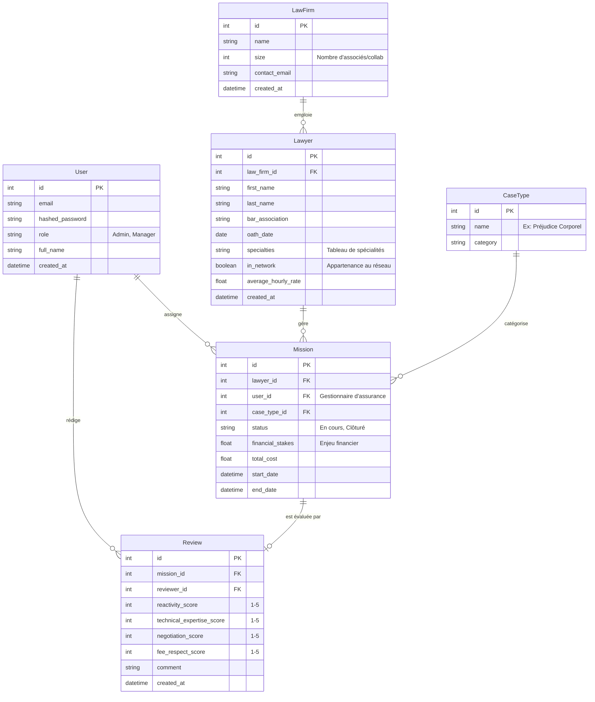

# LexMetric - Architecture Technique

## 1. Arborescence du Projet

```text
lexmetric/
├── backend/
│   ├── Dockerfile
│   ├── requirements.txt
│   ├── app/
│   │   ├── __init__.py
│   │   ├── main.py              # Point d'entrée FastAPI
│   │   ├── api/
│   │   │   ├── endpoints/       # Routes (ex: lawyers.py)
│   │   │   └── dependencies.py  # Injections de dépendances (DB session, Auth)
│   │   ├── core/
│   │   │   ├── config.py        # Variables d'environnement
│   │   │   ├── security.py      # JWT, Hachage des mots de passe
│   │   │   └── scoring.py       # Algorithme de Matching/Scoring
│   │   ├── db/
│   │   │   ├── database.py      # Configuration SQLAlchemy
│   │   │   └── models.py        # Modèles ORM (SQLAlchemy)
│   │   └── schemas/
│   │       └── schemas.py       # Modèles Pydantic (Validation & Sérialisation)
│   └── tests/
├── frontend/
│   ├── Dockerfile
│   ├── package.json
│   ├── public/
│   └── src/
│       ├── components/          # Composants UI réutilisables
│       ├── features/            # Domaines métiers (ex: search, dashboard)
│       ├── hooks/               # Custom React hooks
│       ├── services/            # Appels API (Axios/Fetch)
│       ├── types/               # Interfaces TypeScript
│       └── App.tsx
└── docker-compose.yml           # Orchestration des conteneurs
```

## 2. Schéma de Base de Données (UML)


